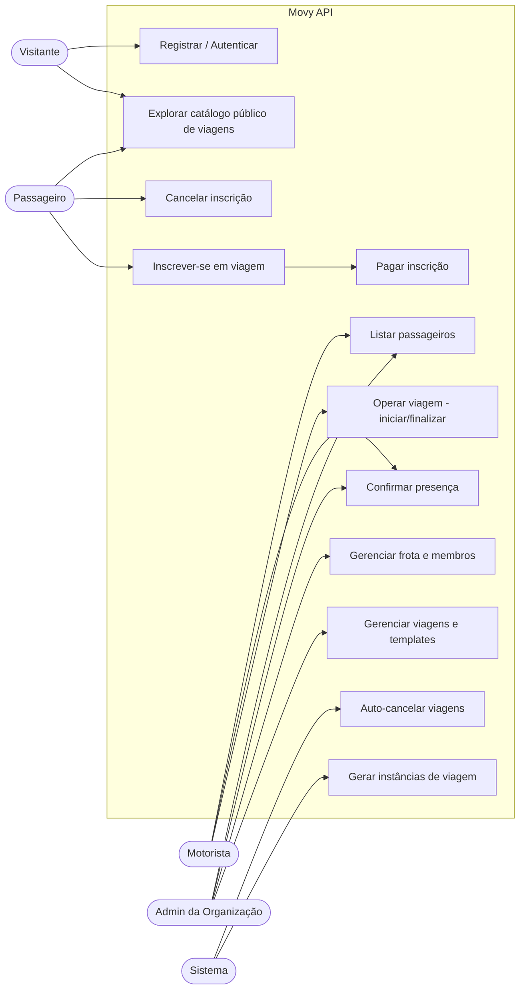
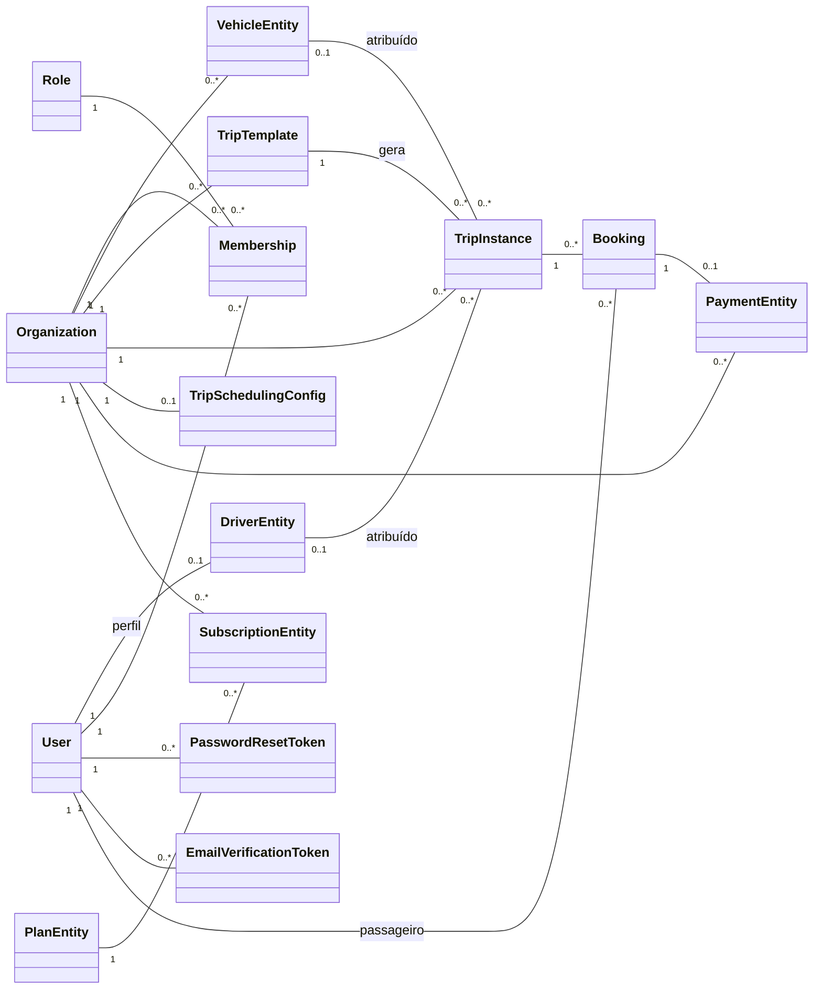
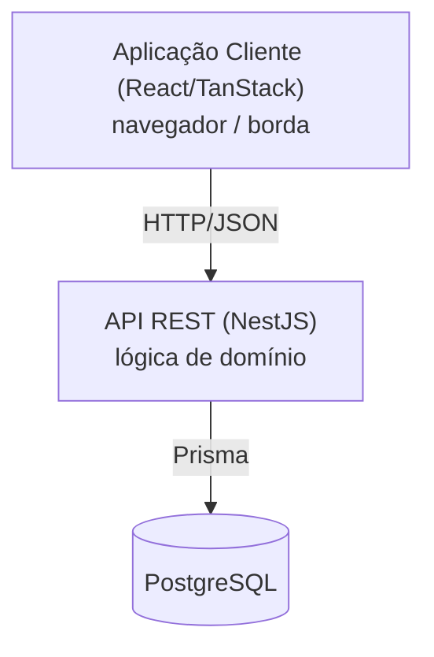
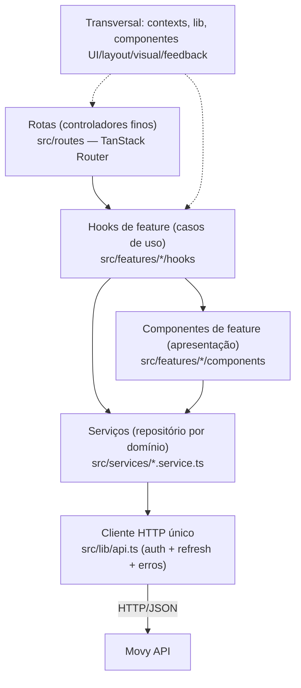
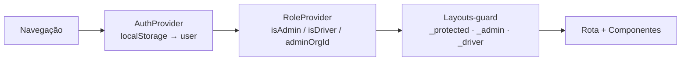
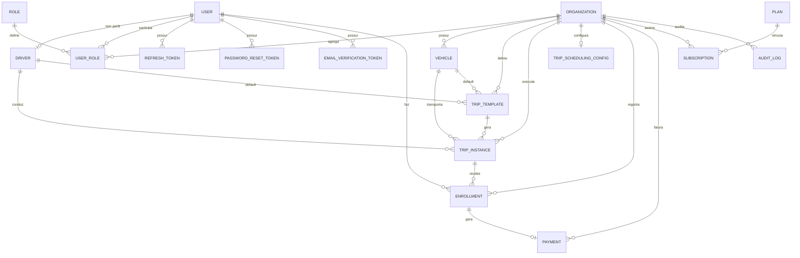
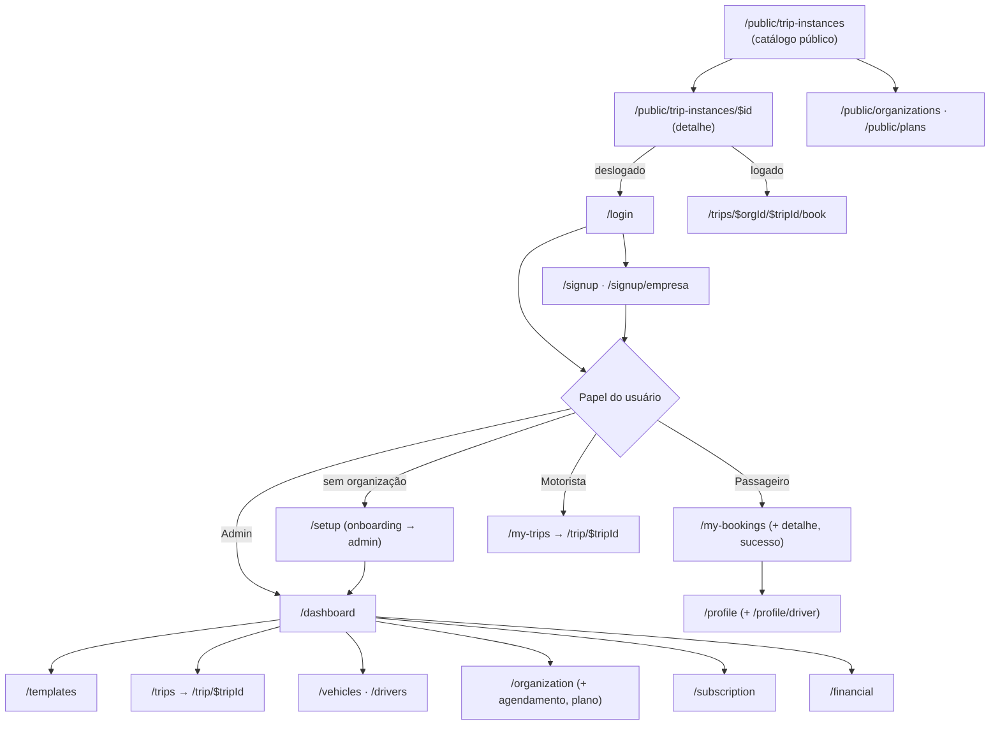
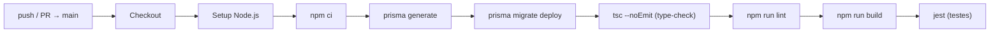
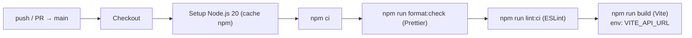

# TCC Movy API — Seções 2.0 a 4.2 (Documentação de Engenharia)

> Documento de trabalho em Markdown. Reescreve, com rigor de TCC, as seções **2.0 Tecnologias**, **3.0 Modelagem** (3.1 a 3.6) e **4.0 Software** (4.1, 4.2).
> A introdução e os objetivos do trabalho **não** fazem parte deste arquivo e não devem ser alterados.
> As métricas e afirmações aqui foram conferidas contra o código-fonte (`package.json`, `prisma/schema.prisma`, `.github/workflows/ci.yml`, `src/modules/**`).

---

# 2.0 Tecnologias Envolvidas

A seleção da pilha tecnológica foi orientada por três critérios: **aderência aos requisitos não funcionais** (Seção 3.1) — em especial segurança (RNF04), manutenibilidade (RNF06) e integridade de dados (RNF08); **maturidade e ecossistema** das ferramentas, reduzindo risco técnico; e **coerência arquitetural**, privilegiando ferramentas que reforçam a separação de camadas adotada (Seção 3.4). A linguagem única (TypeScript) em todo o backend, com tipagem estática estrita, foi uma decisão transversal: ela transporta as invariantes de domínio para o compilador e sustenta a confiança nas refatorações exigidas por um trabalho de longa duração.

## 2.1 Visão geral da pilha (backend)

| ID  | Tecnologia                              | Versão          | Camada/Categoria       | Função no projeto                                                                |
| --- | --------------------------------------- | --------------- | ---------------------- | -------------------------------------------------------------------------------- |
| T01 | Node.js                                 | 22 LTS (CI: 24) | Runtime                | Ambiente de execução do servidor JavaScript/TypeScript                           |
| T02 | TypeScript                              | 5.7             | Linguagem              | Tipagem estática estrita; expressa invariantes de domínio em tempo de compilação |
| T03 | NestJS                                  | 11              | Framework de aplicação | Modularização, injeção de dependência, guards, interceptors e filtros            |
| T04 | Prisma ORM                              | 7.5             | Acesso a dados         | Mapeamento objeto-relacional, migrações versionadas e Prisma Client tipado       |
| T05 | `@prisma/adapter-pg` + `pg`             | 7.5 / 8.20      | Driver de banco        | Conexão nativa com PostgreSQL via driver adapter                                 |
| T06 | PostgreSQL                              | 17              | Banco de dados         | Persistência relacional com transações ACID (RNF08/RNF09)                        |
| T07 | `@nestjs/jwt` + `passport-jwt`          | 11 / 4.0        | Autenticação           | Emissão e validação de JSON Web Tokens (RNF04)                                   |
| T08 | `bcrypt`                                | 6.0             | Segurança              | Hash de senhas com salt (10 rounds)                                              |
| T09 | `class-validator` + `class-transformer` | 0.15 / 0.5      | Validação              | Validação declarativa de DTOs na borda HTTP                                      |
| T10 | `@nestjs/throttler`                     | 6.5             | Resiliência            | Rate limiting global (60 req/min/IP)                                             |
| T11 | `@nestjs/schedule` + `cron-parser`      | 6.1 / 5.5       | Automação              | Jobs CRON (geração e auto-cancelamento de viagens)                               |
| T12 | `@nestjs/swagger`                       | 11.2            | Documentação           | Especificação OpenAPI interativa em `/api` (RNF01)                               |
| T13 | Jest + ts-jest                          | 30 / 29         | Testes                 | Testes unitários (458 testes / 57 suites)                                        |
| T14 | Docker + Docker Compose                 | —               | Containerização        | Empacotamento reproduzível da API e do PostgreSQL                                |
| T15 | GitHub Actions                          | —               | CI                     | Integração contínua (lint, type-check, build, testes)                            |

> A aplicação cliente (React 19 / TanStack Router / Tailwind / Vite) é detalhada na Seção 2.3 (pilha) e na Seção 3.4.6 (arquitetura). Reside em repositório separado e segue uma arquitetura em camadas que espelha a do backend.

## 2.2 Justificativa técnica das escolhas centrais

**NestJS (T03).** Atende diretamente ao RNF06 (manutenibilidade): seu sistema de módulos e a injeção de dependência nativa viabilizam a Clean Architecture adotada sem bibliotecas adicionais. Os mecanismos de _guards_, _interceptors_ e _exception filters_ expressam, como cidadãos de primeira classe do framework, exatamente os interesses transversais do sistema — autenticação, autorização multi-tenant e mapeamento de erros de domínio para HTTP. Alternativas como Express puro exigiriam reconstruir esses mecanismos manualmente; frameworks de outras linguagens romperiam a unidade TypeScript ponta a ponta.

**Prisma ORM (T04).** O Prisma fornece um _client_ totalmente tipado gerado a partir do schema, o que estende a garantia de tipos do TypeScript até a fronteira do banco e reduz a classe de erros de consulta. Suas migrações versionadas (28 no projeto) dão rastreabilidade à evolução do esquema, e o suporte a transações sustenta o RNF08 (integridade). Optou-se pelo _driver adapter_ (`@prisma/adapter-pg`) para usar o driver `pg` nativo, alinhando o comportamento de produção e de testes.

**PostgreSQL (T06).** Banco relacional maduro com garantias ACID plenas, indexação composta e _constraints_ declarativas (chaves únicas, integridade referencial com `onDelete: Restrict`/`SetNull`). Essas garantias são essenciais para o controle de vagas sem _overbooking_ (RF22) e para o isolamento multi-tenant via `organizationId` (RNF05).

**JWT + Passport + bcrypt (T07/T08).** Implementam o RNF04. O JWT permite autenticação _stateless_ — o payload é enriquecido no login/refresh, evitando consulta ao banco a cada requisição (sustentando o RNF02, performance) — enquanto a revogação por `jti` preserva a capacidade de invalidar sessões. O bcrypt protege as credenciais em repouso.

**class-validator (T09) e Swagger (T12).** Juntos materializam o RNF01: a validação declarativa garante respostas 400 consistentes na borda, e a especificação OpenAPI documenta a superfície REST de forma navegável, favorecendo a integração por front-ends e terceiros.

**Throttler (T10) e Schedule (T11).** O _rate limiting_ global protege contra abuso e contribui para a disponibilidade (RNF03). O agendador suporta os processos automatizados de domínio (geração e cancelamento de viagens), que são parte essencial da regra de negócio de viagens recorrentes.

**Docker e GitHub Actions (T14/T15).** Garantem reprodutibilidade do ambiente e verificação contínua da saúde do código. O detalhamento do pipeline e da containerização está na Seção 4.1.

## 2.3 Visão geral da pilha (cliente)

A aplicação cliente é uma SPA com renderização no servidor (SSR) na borda, escrita inteiramente em TypeScript — a mesma linguagem do backend, o que permite reaproveitar o vocabulário de domínio em tipos e reduzir o atrito de integração. As escolhas foram orientadas pelos requisitos não funcionais de usabilidade _mobile-first_ (RNF10), resiliência de sessão (RNF11) e consistência temporal (RNF12), além de manutenibilidade (RNF06). As versões abaixo foram conferidas contra o `package.json` do repositório do cliente.

| ID   | Tecnologia                                             | Versão          | Camada/Categoria      | Função no projeto                                                                     |
| ---- | ------------------------------------------------------ | --------------- | --------------------- | ------------------------------------------------------------------------------------- |
| TC01 | React                                                  | 19.2            | Biblioteca de UI      | Renderização declarativa por componentes; _hooks_ como casos de uso                   |
| TC02 | TypeScript                                             | 5.8             | Linguagem             | Tipagem estrita (`strict`); interfaces que espelham os contratos da API               |
| TC03 | TanStack Router                                        | 1.168           | Roteamento            | Roteamento _file-based_, _type-safe_, com `validateSearch` (Zod) e _layouts pathless_ |
| TC04 | TanStack React Start                                   | 1.167           | Framework full-stack  | SSR/_server entry_ e empacotamento para a borda (Cloudflare)                          |
| TC05 | Vite                                                   | 7.3             | Build / Dev server    | _Bundler_ e servidor de desenvolvimento com HMR                                       |
| TC06 | `@lovable.dev/vite-tanstack-config`                    | 1.4             | Preset de build       | Configuração Vite encapsulada (plugins, alias `@/*`, injeção de `VITE_*`)             |
| TC07 | Tailwind CSS                                           | 4.2             | Estilização           | CSS utilitário _mobile-first_ via `@tailwindcss/vite` (RNF10)                         |
| TC08 | shadcn/ui + Radix UI                                   | —               | Componentes de UI     | Primitivos acessíveis (Dialog, Select, Tabs, etc.) copiados ao projeto                |
| TC09 | `class-variance-authority` + `tailwind-merge` + `clsx` | 0.7 / 3.5 / 2.1 | Utilidades de estilo  | Variantes de componente e composição de classes sem conflito                          |
| TC10 | Zod                                                    | 3.24            | Validação             | Esquemas de formulário (`safeParse`) e de _search params_ de rota                     |
| TC11 | `lucide-react`                                         | 0.575           | Iconografia           | Conjunto de ícones SVG                                                                |
| TC12 | `sonner`                                               | 2.0             | Feedback              | _Toasts_ — superfície de exibição dos erros normalizados (RNF11)                      |
| TC13 | `recharts`                                             | 2.15            | Visualização de dados | Gráficos do _dashboard_ e do relatório financeiro                                     |
| TC14 | `date-fns`                                             | 4.1             | Datas                 | Manipulação de datas (complementa os _helpers_ de fuso em `lib/timezone`)             |
| TC15 | `vaul`                                                 | 1.1             | UI / Interação        | _Drawer_ de baixo (base do primitivo `BottomSheet`) — padrão de formulários           |
| TC16 | `cmdk`                                                 | 1.1             | UI / Interação        | _Command palette_ / combobox de busca                                                 |
| TC17 | `canvas-confetti`                                      | 1.9             | UX                    | Confirmação visual pós-inscrição (tela de sucesso)                                    |
| TC18 | `@cloudflare/vite-plugin` + `wrangler`                 | 1.25 / —        | Implantação           | Empacotamento e execução como Cloudflare Worker (ver Seção 4.1)                       |
| TC19 | ESLint + Prettier                                      | 9 / 3           | Qualidade estática    | _Lint_ e formatação verificados no CI (ver Seção 4.2)                                 |

> A tabela lista a pilha **efetivamente em uso**. Dependências herdadas do _scaffold_ inicial e não consumidas (`@tanstack/react-query`, `react-hook-form`, `@hookform/resolvers`) foram removidas na reestruturação — ver a nota de gênese em 2.4.

## 2.4 Justificativa técnica das escolhas do cliente

**Gênese da interface (desenvolvimento assistido por IA).** A aplicação cliente foi desenvolvida integralmente com apoio de ferramentas de IA, em três papéis complementares: (i) **Lovable**, usado para a **prototipação inicial** — gerar rapidamente uma base funcional navegável e validar o fluxo do produto desde cedo; (ii) **Claude**, usado para **reestruturar a interface a partir de novos protótipos de _design_**, etapa em que a arquitetura em camadas (Seção 3.4.6) e os padrões de tela (Seção 3.6) foram consolidados; e (iii) **Claude Code**, usado para a **integração e o trabalho no repositório** — refatoração, implementação dos _hooks_/serviços e manutenção do código versionado. Esse percurso explica por que parte da pilha selecionada pelo _scaffold_ inicial não é consumida pelo código atual: escolhas herdadas do gerador inicial convivem com as decisões da reestruturação. O único vestígio funcional que permanece dessa origem é o preset de _build_ `@lovable.dev/vite-tanstack-config` (`vite.config.ts`), que segue **em uso** por encapsular toda a configuração do Vite. Os demais resíduos do _scaffold_ foram saneados na reestruturação: as dependências herdadas e não adotadas (`@tanstack/react-query`, `react-hook-form`, `@hookform/resolvers`) **foram removidas do projeto** sem impacto funcional, e os metadados de marca do gerador em `__root.tsx` foram substituídos pela identidade do produto (Movy).

**TanStack Router + React Start (TC03/TC04).** O roteamento _file-based_ materializa o catálogo de telas da Seção 3.6 como arquivos, e os _layouts pathless_ (`_protected`, `_admin`, `_driver`) concentram os _guards_ de acesso por papel em um único ponto, sustentando a manutenibilidade (RNF06). A tipagem de rotas, parâmetros e _search params_ (validados por Zod) estende a garantia de tipos do TypeScript até a navegação. O React Start fornece a renderização no servidor e o _server entry_ consumido pelo alvo de implantação (RNF07, portabilidade via HTTP/JSON).

**Tailwind CSS + shadcn/ui + vaul (TC07/TC08/TC15).** Atendem diretamente ao **RNF10** (usabilidade _mobile-first_, em pt-BR): o CSS utilitário privilegia _layouts_ fluidos para tela pequena; os primitivos acessíveis do Radix dão semântica e navegação por teclado sem reescrever comportamento; e o `BottomSheet` (sobre `vaul`) padroniza formulários e edição em interação de toque. A navegação inferior por papel (`BottomNav`) reforça o padrão de aplicativo móvel.

**Zod (TC10).** Centraliza a validação na borda do cliente, espelhando a validação de DTOs do backend. Os formulários reais usam estado controlado (`useState`) com `safeParse`, e as rotas validam _search params_ com `validateSearch` — uma única biblioteca de esquema cobre os dois casos, reduzindo divergência de regras entre cliente e servidor (RNF06).

**Cliente HTTP único e `sonner` (TC12).** A resiliência de sessão (**RNF11**) é implementada no cliente HTTP (`lib/api.ts`): renovação de _token_ transparente e **deduplicada** em respostas 401, e exposição de um `errorCode` estável que `handle-error.ts` traduz para mensagens em pt-BR exibidas via _toast_. A UI deriva o comportamento do **código** do erro, não do _parsing_ da mensagem (Seção 3.4.6).

**`lib/timezone` + `date-fns` (TC14).** Sustentam a **consistência temporal** (RNF12): a API trafega horários em UTC e o cliente sempre os exibe em horário de Brasília (`America/Sao_Paulo`), com _helpers_ dedicados de conversão HH:mm e de formatação de instantes/datas-calendário — evitando erros de fuso e _off-by-one_.

**Gestão de estado e formulários (escolha da reestruturação).** Na versão atual, o **estado de servidor** é gerido por _Context_ + _hooks_ (decisão ADR-002), e os **formulários** por estado controlado (`useState`) com validação Zod (`safeParse`). Por isso, as bibliotecas que o _scaffold_ inicial trouxera para esses papéis — `@tanstack/react-query`, `react-hook-form` e `@hookform/resolvers` (esta última nem chegou a ser importada; `react-hook-form` vivia apenas no primitivo shadcn `components/ui/form.tsx`, sem consumidores) — foram **removidas do projeto**, eliminando dependências mortas e mantendo o `package.json` coerente com o código.

---

# 3.0 Modelagem do Projeto

## 3.1 Levantamento de Requisitos

Os requisitos foram derivados da observação do funcionamento atual do transporte universitário intermunicipal e das necessidades relatadas por estudantes, motoristas e gestores. São **requisitos de sistema**: expostos pela API e materializados em telas pela aplicação cliente. Adota-se a priorização **MoSCoW** (Essencial = _Must_, Importante = _Should_, Desejável = _Could_) e registra-se a **situação** atual de implementação, fornecendo rastreabilidade honesta entre escopo planejado e escopo entregue. Itens marcados como _Desejável_ com situação "Não implementado" constituem dívida declarada, reconhecida nas limitações do trabalho.

### 3.1.1 Requisitos Funcionais (RF)

| ID   | Requisito Funcional                                                                   | Prioridade | Ator            | Situação                          |
| ---- | ------------------------------------------------------------------------------------- | ---------- | --------------- | --------------------------------- |
| RF01 | Cadastrar usuários com dados pessoais, identificação e possível vínculo a organização | Essencial  | Visitante       | Implementado                      |
| RF02 | Cadastrar organizações e administradores responsáveis pela gestão                     | Essencial  | Visitante/Admin | Implementado                      |
| RF03 | Cadastrar motoristas vinculados às viagens                                            | Essencial  | Admin           | Implementado                      |
| RF04 | Agendar viagens com data, horário, turno e destino                                    | Essencial  | Admin           | Implementado                      |
| RF05 | Cancelar viagens pela organização/administrador                                       | Essencial  | Admin           | Implementado                      |
| RF06 | Definir turnos das viagens (manhã, tarde, noite)                                      | Importante | Admin           | Implementado                      |
| RF07 | Permitir que usuários se inscrevam em viagens disponíveis                             | Essencial  | Passageiro      | Implementado                      |
| RF08 | Cancelar inscrição dentro de um prazo definido                                        | Essencial  | Passageiro      | Implementado                      |
| RF09 | Escolher o tipo de trajeto (ida, volta, ida e volta)                                  | Importante | Passageiro      | Implementado                      |
| RF10 | Indicar a forma de pagamento associada à viagem (PIX, dinheiro, cartão)               | Importante | Passageiro      | Implementado (simulado)           |
| RF11 | Visualizar a lista de passageiros inscritos em cada viagem                            | Essencial  | Admin           | Implementado                      |
| RF12 | Confirmar a presença do passageiro no embarque                                        | Importante | Admin/Motorista | Implementado                      |
| RF13 | Permitir que o motorista visualize a lista de passageiros                             | Importante | Motorista       | Implementado                      |
| RF14 | Permitir que o motorista marque a viagem como iniciada/concluída                      | Essencial  | Motorista       | Implementado                      |
| RF15 | Gerar relatórios das viagens realizadas                                               | Desejável  | Admin           | Não implementado                  |
| RF16 | Visualizar histórico de viagens da organização                                        | Importante | Admin           | Parcial (listagem de instâncias)  |
| RF17 | Enviar notificações de lembrete de inscrição                                          | Desejável  | Sistema         | Não implementado                  |
| RF18 | Enviar notificações de confirmação/cancelamento                                       | Desejável  | Sistema         | Não implementado                  |
| RF19 | Calcular estimativa financeira de arrecadação por viagem                              | Importante | Admin           | Implementado (preço/`minRevenue`) |
| RF20 | Cadastrar meios de transporte (ônibus, vans, etc.)                                    | Essencial  | Admin           | Implementado                      |
| RF21 | Vincular meios de transporte e motoristas às viagens                                  | Essencial  | Admin           | Implementado                      |
| RF22 | Impedir inscrições acima da capacidade máxima                                         | Essencial  | Sistema         | Implementado                      |
| RF23 | Cadastrar pontos de embarque pela organização                                         | Desejável  | Admin           | Não implementado (texto livre)    |
| RF24 | Selecionar ponto de embarque no momento da inscrição                                  | Importante | Passageiro      | Parcial (`boardingStop` livre)    |
| RF25 | Permitir que o motorista visualize os pontos de embarque das inscrições               | Importante | Motorista       | Parcial                           |
| RF26 | Registrar logs de auditoria                                                           | Desejável  | Sistema         | Modelado, não persistido          |

> Atores adicionais: **Admin do Sistema (Dev)** — opera funções globais (planos, criação de organizações/usuários para teste) por trás do `DevGuard`; **Sistema** — processos automatizados (CRON).

### 3.1.2 Requisitos Não Funcionais (RNF)

Classificados pelas características de qualidade da norma **ISO/IEC 25010**, com critério de aceite mensurável quando aplicável.

| ID    | Característica (ISO/IEC 25010)    | Descrição                                                    | Métrica / Critério de aceite                                                       |
| ----- | --------------------------------- | ------------------------------------------------------------ | ---------------------------------------------------------------------------------- |
| RNF01 | Compatibilidade / Usabilidade     | API RESTful com verbos e códigos de status HTTP padronizados | Uso correto de métodos HTTP; OpenAPI publicada em `/api`                           |
| RNF02 | Eficiência de desempenho          | Latência baixa em consultas                                  | Tempo de resposta < 2 s em requisições de consulta                                 |
| RNF03 | Confiabilidade (disponibilidade)  | Continuidade do serviço em horários críticos                 | Disponibilidade ≥ 95%                                                              |
| RNF04 | Segurança                         | Autenticação e controle de acesso                            | JWT + RBAC; conformidade com princípios da LGPD; senhas com hash                   |
| RNF05 | Eficiência / Manutenibilidade     | Escalabilidade horizontal e multi-tenancy                    | Isolamento lógico por `organizationId`; API _stateless_                            |
| RNF06 | Manutenibilidade                  | Código sustentável e evolutivo                               | Clean Architecture + SOLID sobre NestJS                                            |
| RNF07 | Portabilidade / Compatibilidade   | Independência de plataforma                                  | Comunicação exclusiva via JSON                                                     |
| RNF08 | Confiabilidade (integridade)      | Consistência das informações                                 | Transações ACID; ausência de inscrições duplicadas/overbooking                     |
| RNF09 | Confiabilidade (recuperabilidade) | Persistência durável                                         | Armazenamento em PostgreSQL relacional                                             |
| RNF10 | Usabilidade                       | Experiência do cliente                                       | Interface _mobile-first_, em pt-BR, com formatos locais de data/moeda              |
| RNF11 | Confiabilidade / Usabilidade      | Resiliência de sessão                                        | Renovação de token transparente e deduplicada; erros derivados de códigos estáveis |
| RNF12 | Adequação funcional / Usabilidade | Consistência temporal                                        | Horários em UTC na API, exibidos em horário de Brasília no cliente                 |

## 3.2 Diagramas de Casos de Uso

### 3.2.1 Atores

Os atores correspondem aos papéis do controle de acesso, em precedência crescente de capacidades:

- **Visitante** — usuário não autenticado; explora o catálogo público de viagens e os perfis públicos de organizações.
- **Passageiro** — usuário autenticado; reserva e gerencia inscrições, efetua pagamentos e pode candidatar-se a motorista.
- **Motorista** — opera as viagens que lhe são atribuídas (visualizar passageiros, iniciar/finalizar, confirmar presença).
- **Administrador da Organização** — gerencia rotas, viagens, frota, membros, plano e métricas da sua organização.
- **Administrador do Sistema (Dev)** — opera funções globais (catálogo de planos, provisionamento) por trás do `DevGuard`.
- **Sistema** — processos automatizados (jobs CRON de geração e cancelamento de viagens).

### 3.2.2 Diagrama de casos de uso

O diagrama agrupa os casos de uso por ator. (Imagem a exportar/inserir — ver `imagens/usecases_diagram.png`.)



### 3.2.3 Matriz de rastreabilidade Requisito → Caso de Uso

Cada requisito funcional é realizado por um ou mais casos de uso, garantindo cobertura sem lacunas. A numeração dos UCs segue o catálogo de `docs/usecases.md`.

| RF   | Caso(s) de uso         | RF   | Caso(s) de uso                             |
| ---- | ---------------------- | ---- | ------------------------------------------ |
| RF01 | UC-001                 | RF14 | UC-043, UC-044                             |
| RF02 | UC-007, UC-012         | RF15 | — (não implementado)                       |
| RF03 | UC-029                 | RF16 | UC-040, UC-048                             |
| RF04 | UC-033, UC-034, UC-039 | RF17 | — (não implementado)                       |
| RF05 | UC-045                 | RF18 | — (não implementado)                       |
| RF06 | UC-034                 | RF19 | UC-041 (estimativa via `minRevenue`/preço) |
| RF07 | UC-046                 | RF20 | UC-024                                     |
| RF08 | UC-049, UC-061         | RF21 | UC-042                                     |
| RF09 | UC-047                 | RF22 | UC-064                                     |
| RF10 | UC-052                 | RF23 | — (não implementado)                       |
| RF11 | UC-050                 | RF24 | UC-047 (`boardingStop`)                    |
| RF12 | UC-051                 | RF25 | UC-050                                     |
| RF13 | UC-050                 | RF26 | UC-056, UC-057 (modelado)                  |

### 3.2.4 Especificação textual dos casos de uso centrais

Os casos de uso de maior valor de negócio são especificados com fluxo principal, alternativos e de exceção. Os demais (CRUD de cadastro) seguem o mesmo padrão de forma resumida no catálogo de apoio.

---

**UC-002 — Autenticar usuário (Login)**

- **Ator principal:** Visitante. **Secundário:** —
- **Pré-condições:** usuário previamente cadastrado e ativo.
- **Pós-condições (sucesso):** _access token_ (JWT, 1 h) e _refresh token_ (7 d) emitidos; contexto de tenant embutido no payload.
- **Fluxo Principal:**
  1. O ator informa e-mail e senha.
  2. O sistema valida o formato das credenciais (DTO).
  3. O sistema localiza o usuário pelo e-mail.
  4. O sistema compara a senha com o hash bcrypt armazenado.
  5. O sistema enriquece o payload (id, e-mail, organização e papel, quando houver) e emite os tokens.
  6. O sistema retorna os tokens ao ator.
- **Fluxos Alternativos:**
  - A1 (usuário sem organização): o payload é emitido sem `organizationId`/`role`; o ator atua apenas como Passageiro/B2C.
- **Fluxos de Exceção:**
  - E1 (credenciais inválidas): senha não confere ou e-mail inexistente → erro `*_UNAUTHORIZED` (HTTP 401), sem revelar qual campo falhou.
  - E2 (conta inativa): usuário com `status = INACTIVE` → erro de autorização (HTTP 401/403).
- **Regras de negócio / RF:** RF01; RNF04 (segurança), RNF02 (sem consulta extra ao banco por requisição).
- **Frequência / Prioridade:** Altíssima / Essencial.

---

**UC-046 — Inscrever-se em uma instância de viagem (Booking)**

- **Ator principal:** Passageiro.
- **Pré-condições:** ator autenticado; instância de viagem existente e elegível (status `SCHEDULED`/`CONFIRMED`, pública ou da organização do ator).
- **Pós-condições (sucesso):** inscrição criada com status `ACTIVE`, preço registrado de forma imutável; registro de pagamento associado criado em estado `PENDING`.
- **Fluxo Principal:**
  1. O ator seleciona uma viagem e o tipo de trajeto (ida/volta/ida e volta).
  2. O ator informa pontos de embarque/desembarque e a forma de pagamento.
  3. O sistema verifica a disponibilidade de vagas (capacidade vs. inscrições ativas).
  4. O sistema valida as regras de inscrição (viagem elegível, ator não inscrito em duplicidade).
  5. O sistema calcula e **congela** o preço conforme o tipo de trajeto.
  6. O sistema persiste a inscrição e cria o pagamento `PENDING` na mesma transação.
  7. O sistema retorna os dados da inscrição.
- **Fluxos Alternativos:**
  - A1 (trajeto ida e volta): o preço de `roundTrip` é aplicado em vez do preço unitário.
- **Fluxos de Exceção:**
  - E1 (capacidade esgotada): vagas indisponíveis → erro `*_FORBIDDEN`/`*_BAD_REQUEST` (RF22, UC-064).
  - E2 (inscrição duplicada): ator já possui inscrição ativa na viagem → erro `*_ALREADY_EXISTS` (HTTP 409).
  - E3 (viagem inelegível): status não permite inscrição → erro de validação (UC-063).
- **Regras de negócio / RF:** RF07, RF09, RF10, RF22; integridade transacional (RNF08); preço imutável (UC-065).
- **Frequência / Prioridade:** Alta / Essencial.

---

**UC-049 — Cancelar inscrição**

- **Ator principal:** Passageiro. **Secundário:** Admin da Organização.
- **Pré-condições:** inscrição existente e `ACTIVE`; ator é o titular ou membro da organização.
- **Pós-condições (sucesso):** inscrição com status `INACTIVE` (soft delete); vaga liberada.
- **Fluxo Principal:**
  1. O ator solicita o cancelamento de uma inscrição.
  2. O sistema verifica a titularidade/pertencimento (proteção IDOR).
  3. O sistema valida a janela de cancelamento (até ~30 min antes da partida) e o status da viagem (UC-061).
  4. O sistema marca a inscrição como `INACTIVE`.
  5. O sistema confirma o cancelamento.
- **Fluxos Alternativos:**
  - A1 (cancelamento pelo Admin): membro da organização cancela em nome do passageiro.
- **Fluxos de Exceção:**
  - E1 (prazo expirado): partida muito próxima → erro `*_BAD_REQUEST`/`*_FORBIDDEN`.
  - E2 (inscrição já inativa): operação rejeitada (estado inválido).
  - E3 (acesso indevido): ator não é titular nem membro → erro `*_FORBIDDEN` (HTTP 403).
- **Regras de negócio / RF:** RF08; janela de cancelamento; soft delete.
- **Frequência / Prioridade:** Média / Essencial.

---

**UC-043 / UC-044 — Iniciar e finalizar viagem (transição de status)**

- **Ator principal:** Motorista. **Secundário:** Admin da Organização.
- **Pré-condições:** instância de viagem atribuída ao motorista; transição válida na máquina de estados.
- **Pós-condições (sucesso):** `tripStatus` atualizado conforme a máquina `DRAFT → SCHEDULED → CONFIRMED → IN_PROGRESS → FINISHED` (ou `CANCELED`).
- **Fluxo Principal:**
  1. O ator solicita a transição de status (ex.: iniciar → `IN_PROGRESS`).
  2. O sistema verifica que o ator é o motorista atribuído (ou Admin da organização).
  3. O sistema valida que a transição é permitida pela máquina de estados.
  4. O sistema valida pré-condições operacionais (motorista e veículo atribuídos — UC-062).
  5. O sistema persiste o novo status.
- **Fluxos Alternativos:**
  - A1 (finalizar): transição `IN_PROGRESS → FINISHED` (UC-044).
  - A2 (cancelar pelo Admin): transição para `CANCELED` (UC-045).
- **Fluxos de Exceção:**
  - E1 (transição inválida): estado de origem incompatível → erro `*_BAD_REQUEST`.
  - E2 (recursos ausentes): viagem sem motorista/veículo ao iniciar → erro de validação (UC-062).
  - E3 (motorista não atribuído): ator não opera aquela viagem → erro `*_FORBIDDEN`.
- **Regras de negócio / RF:** RF14; máquina de estados de viagem.
- **Frequência / Prioridade:** Alta / Essencial.

---

**UC-039 — Gerar instâncias de viagem a partir de templates (CRON)**

- **Ator principal:** Sistema. **Secundário:** Admin (gatilho manual).
- **Pré-condições:** existirem templates recorrentes ativos; `TripSchedulingConfig` habilitado; assinatura ativa com cota de viagens disponível.
- **Pós-condições (sucesso):** instâncias datadas criadas para a janela de planejamento, sem duplicação.
- **Fluxo Principal:**
  1. O job dispara diariamente (02:00 UTC) ou é acionado manualmente pelo Admin.
  2. O sistema lê os templates recorrentes ativos por organização.
  3. Para cada data da janela, o sistema verifica idempotência via chave única `(tripTemplateId, departureTime)`.
  4. O sistema valida a cota mensal do plano (`PlanLimitService`).
  5. O sistema cria as instâncias ausentes em estado inicial.
- **Fluxos Alternativos:**
  - A1 (gatilho manual): Admin invoca a geração para um template específico.
- **Fluxos de Exceção:**
  - E1 (instância já existente): a chave única impede duplicação — instância é ignorada.
  - E2 (cota excedida): limite mensal do plano atingido → geração interrompida para a organização (RF22 análogo a billing).
  - E3 (execução concorrente): guarda em processo evita sobreposição de execuções no mesmo réplica.
- **Regras de negócio / RF:** RF04; idempotência; cotas de plano.
- **Frequência / Prioridade:** Diária (automática) / Essencial.

---

**UC-051 — Confirmar presença do passageiro**

- **Ator principal:** Admin da Organização / Motorista.
- **Pré-condições:** inscrição `ACTIVE` na viagem; ator é membro da organização da viagem.
- **Pós-condições (sucesso):** inscrição marcada com `presenceConfirmed = true`.
- **Fluxo Principal:**
  1. O ator acessa a lista de passageiros da viagem (UC-050).
  2. O ator marca a presença de um passageiro a bordo.
  3. O sistema valida o pertencimento do ator à organização (IDOR).
  4. O sistema registra a confirmação de presença.
- **Fluxos de Exceção:**
  - E1 (inscrição inativa/cancelada): operação rejeitada.
  - E2 (acesso indevido): ator fora da organização → erro `*_FORBIDDEN`.
- **Regras de negócio / RF:** RF12; isolamento multi-tenant.
- **Frequência / Prioridade:** Média / Importante.

---

> **Catálogo completo:** os 60+ casos de uso (CRUD de usuários, organizações, membros, frota, planos, assinaturas e pagamentos) estão enumerados em `docs/usecases.md`, com as respectivas histórias de usuário. Esta seção detalha os fluxos críticos; os demais seguem o mesmo template em forma resumida.

## 3.3 Diagrama de Classe

O modelo de domínio segue os princípios do _Domain-Driven Design_ (DDD): cada entidade é um agregado com métodos de fábrica estáticos — `create()`, que valida invariantes, e `restore()`, que reidrata a partir da persistência sem revalidar — e os atributos de regra de negócio são encapsulados em **Value Objects** imutáveis (`Email`, `Cnpj`, `Cnh`, `Plate`, `Money`, etc.). Para legibilidade, apresenta-se um **mapa panorâmico** das entidades e, em seguida, o **dicionário de classes**. As figuras de detalhe por _bounded context_ (com atributos, métodos e Value Objects de cada contexto) encontram-se em `docs/DIAGRAMA_CLASSES.md` (Figs. 2 a 7), do qual estas figuras são exportadas.

> A aplicação cliente **não possui um modelo de classes próprio**: ela projeta o modelo do backend por meio de _tipos_ (interfaces TypeScript) que espelham os contratos da API.

### 3.3.1 Mapa panorâmico de entidades



### 3.3.2 Dicionário de classes

Organizado pelos cinco contextos delimitados. Estereótipos: **E** = Entidade/Agregado; **VO** = Value Object.

**(i) Identidade & Acesso**

| Classe                                                                                          | Tipo | Atributos principais                                                                 | Métodos principais                                    | Relacionamentos                                                      |
| ----------------------------------------------------------------------------------------------- | ---- | ------------------------------------------------------------------------------------ | ----------------------------------------------------- | -------------------------------------------------------------------- |
| `User`                                                                                          | E    | id, name (UserName), email (Email), passwordHash, telephone, status, emailVerifiedAt | `create`, `restore`, `markEmailVerified`, `setStatus` | 1—0..1 Driver; 1—0..\* Membership/Booking/tokens                     |
| `Organization`                                                                                  | E    | id, name, cnpj (Cnpj), email, telephone, slug (Slug), address, status                | `create`, `restore`, `setStatus`                      | 1—0.._ Membership/Vehicle/Trip_/Payment/Subscription                 |
| `Membership`                                                                                    | E    | userId, roleId, organizationId, assignedAt, removedAt                                | `create`, `remove`, `restoreMembership`               | pivô N:N User↔Organization, chave `(userId, roleId, organizationId)` |
| `Role`                                                                                          | E    | id, name (RoleName)                                                                  | `create`                                              | 1—0..\* Membership                                                   |
| `PasswordResetToken`                                                                            | E    | id, userId, tokenHash, expiresAt, usedAt                                             | `create`, `isValid`, `markUsed`                       | 0..\*—1 User (TTL 1h, só hash)                                       |
| `EmailVerificationToken`                                                                        | E    | id, userId, tokenHash, expiresAt, usedAt                                             | `create`, `isValid`, `markUsed`                       | 0..\*—1 User (TTL 24h, só hash)                                      |
| `Email`, `UserName`, `PasswordHash`, `Telephone`, `Cnpj`, `Slug`, `Address`, `OrganizationName` | VO   | value\_                                                                              | `create` (valida), `restore`                          | compostos por User/Organization                                      |

**(ii) Frota**

| Classe                          | Tipo | Atributos principais                                                     | Métodos principais                                                      | Relacionamentos                             |
| ------------------------------- | ---- | ------------------------------------------------------------------------ | ----------------------------------------------------------------------- | ------------------------------------------- |
| `DriverEntity`                  | E    | id, userId (único), cnh (Cnh), cnhCategories, cnhExpiresAt, driverStatus | `create`, `activate`, `deactivate`, `suspend`, `updateCnh`, `isExpired` | global; 1—1 User; 0..1—0..\* TripInstance   |
| `VehicleEntity`                 | E    | id, plate (Plate), model, type, maxCapacity, organizationId, status      | `create`, `activate`, `deactivate`, `updateMaxCapacity`                 | 0.._—1 Organization; 0..1—0.._ TripInstance |
| `Cnh`, `CnhCategories`, `Plate` | VO   | value\_/values                                                           | `create`, `has` (categorias)                                            | compostos por Driver/Vehicle                |

**(iii) Viagens**

| Classe                 | Tipo | Atributos principais                                                                                                                                                                 | Métodos principais                                                                    | Relacionamentos             |
| ---------------------- | ---- | ------------------------------------------------------------------------------------------------------------------------------------------------------------------------------------ | ------------------------------------------------------------------------------------- | --------------------------- |
| `TripTemplate`         | E    | id, organizationId, departurePoint, destination, frequency[], stops[], horários, capacidade/defaults, preços (Money), minRevenue, isPublic, isRecurring, autoCancel\*, shift, status | `create`, `activate`, `deactivate`, `updatePricing`, `setRecurrence`, `setAutoCancel` | 1—0..\* TripInstance (gera) |
| `TripInstance`         | E    | id, organizationId, tripTemplateId, driverId?, vehicleId?, tripStatus, minRevenue, autoCancelAt, forceConfirm, totalCapacity, isPublic, departureTime, arrivalEstimate               | `create`, `transitionTo` (máquina de estados), `assignDriver`, `assignVehicle`        | 1—0..\* Booking             |
| `TripSchedulingConfig` | E    | id, organizationId (único), daysAhead, enabled                                                                                                                                       | `create`, `updateDaysAhead`, `setEnabled`                                             | 0..1—1 Organization         |

**(iv) Reservas & Pagamentos**

| Classe                          | Tipo | Atributos principais                                                                                                                                                     | Métodos principais                    | Relacionamentos                           |
| ------------------------------- | ---- | ------------------------------------------------------------------------------------------------------------------------------------------------------------------------ | ------------------------------------- | ----------------------------------------- |
| `Booking` (tabela `enrollment`) | E    | id, organizationId, userId, tripInstanceId, enrollmentDate, status, presenceConfirmed, enrollmentType, recordedPrice (Money), boardingStop, alightingStop, paymentMethod | `create`, `confirmPresence`, `cancel` | 0..\*—1 TripInstance/User; 1—0..1 Payment |
| `PaymentEntity`                 | E    | id, organizationId, enrollmentId (único), method, amount (Money), status                                                                                                 | `create`, `confirm`, `fail`           | 1—1 Booking (via enrollmentId)            |
| `Money`                         | VO   | value\_                                                                                                                                                                  | `create`, `add`, `subtract`           | usado por Trip\*, Booking, Payment, Plan  |

**(v) Billing**

| Classe               | Tipo | Atributos principais                                                                                 | Métodos principais                                      | Relacionamentos                                 |
| -------------------- | ---- | ---------------------------------------------------------------------------------------------------- | ------------------------------------------------------- | ----------------------------------------------- |
| `PlanEntity`         | E    | id, name (PlanName), price (Money), maxVehicles, maxDrivers, maxMonthlyTrips, durationDays, isActive | `create`, `update`, `deactivate`                        | 1—0..\* Subscription                            |
| `SubscriptionEntity` | E    | id, organizationId, planId, status, startDate, expiresAt                                             | `create`, `cancel`, `changePlan`, `expire`, `isExpired` | 0.._—1 Organization (1 ACTIVE/vez); 0.._—1 Plan |

> Detalhe de atributos, métodos e enums por contexto: ver Figs. 2–7 em `docs/DIAGRAMA_CLASSES.md`.

## 3.4 Arquitetura do Sistema

Em alto nível, o sistema compõe-se de três elementos: a **aplicação cliente** (executada no navegador), a **API REST** (que concentra a lógica de domínio) e o **banco de dados** relacional. O cliente comunica-se com a API exclusivamente via HTTP/JSON (RNF07), e somente a API acessa o banco. Cliente e servidor seguem o mesmo princípio — separação de responsabilidades em camadas com fluxo de dados unidirecional — de modo que a arquitetura do cliente **espelha** a do servidor.



### 3.4.1 Padrões arquiteturais adotados

O backend adota **Clean Architecture** combinada com **DDD Lite**, organizado em **camadas** com a regra de dependência apontando sempre para o domínio (camadas externas conhecem as internas, nunca o contrário). Sobre essa base operam padrões táticos: **Repositório** (abstração da persistência), **Injeção de Dependência** (nativa do NestJS), **Use Case** (cada operação de negócio como classe testável), **Value Object**, **Guard** (proteção de rotas), **Exception Filter** (mapeamento global de erros), **Soft Delete** e **Unit of Work** (transações atômicas via `AsyncLocalStorage` sem expor o Prisma à camada de aplicação). O modelo é **multi-tenant** com isolamento lógico por `organizationId` (RNF05).

### 3.4.2 Camadas e responsabilidades

Cada módulo de feature replica a mesma estrutura (`src/modules/<módulo>/`):

| Camada         | Diretório                 | Responsabilidade                                                                                    | Conhece                                   |
| -------------- | ------------------------- | --------------------------------------------------------------------------------------------------- | ----------------------------------------- |
| Apresentação   | `presentation/`           | Controllers REST, validação de DTOs, _presenters_ (entidade → HTTP)                                 | Aplicação                                 |
| Aplicação      | `application/`            | Use cases (orquestração da regra de negócio), DTOs de entrada/saída                                 | Domínio                                   |
| Domínio        | `domain/`                 | Entidades, Value Objects, erros de domínio, interfaces de repositório                               | — (núcleo, sem dependências de framework) |
| Infraestrutura | `infrastructure/`         | Repositórios Prisma, _mappers_ linha↔entidade, jobs CRON, _providers_                               | Domínio (implementa suas interfaces)      |
| Compartilhada  | `src/shared/` (`@Global`) | Guards, decorators, Value Objects compartilhados, `PrismaService`, `UnitOfWork`, filtro de exceções | transversal                               |

```
src/modules/<módulo>/
├── application/   { dtos/  use-cases/ }
├── domain/        { entities/  errors/  interfaces/ }
├── infrastructure/db/ { mappers/  repositories/ }
└── presentation/  { controllers/  mappers/ }
```

A inversão de dependência ocorre via interfaces de repositório declaradas no **domínio** e implementadas na **infraestrutura**, injetadas pelo container do NestJS — o use case depende da abstração, nunca do Prisma. Isso sustenta o RNF06 e permite testes unitários sem mocks de framework (Seção 4.2).

### 3.4.3 Pipeline de requisição (autenticação e autorização)

Toda requisição autenticada atravessa uma cadeia de _guards_ antes de alcançar o controller. O JWT é validado uma vez e seu payload (enriquecido no login/refresh) abastece o `TenantContext`, evitando consultas ao banco por requisição (RNF02).

```mermaid
flowchart LR
    Req[Requisição] --> JWT[JwtAuthGuard<br/>valida token → TenantContext]
    JWT --> Roles[RolesGuard<br/>@Roles; isDev ignora]
    Roles --> Tenant["TenantFilterGuard<br/>:organizationId == contexto"]
    Tenant --> Dev[DevGuard<br/>só isDev]
    Dev --> Ctrl[Controller]
```

Combinações típicas de guards:

```typescript
@UseGuards(JwtAuthGuard, RolesGuard) @Roles(RoleName.ADMIN)
@UseGuards(JwtAuthGuard, TenantFilterGuard, RolesGuard) @Roles(RoleName.ADMIN)
@UseGuards(JwtAuthGuard, DevGuard) @Dev()
```

O `TenantFilterGuard` é o mecanismo central de proteção contra **IDOR** (OWASP A01): o `:organizationId` da rota precisa coincidir com o do contexto autenticado, impedindo acesso cruzado entre tenants. `organizationId` jamais é lido do corpo da requisição.

### 3.4.4 Tratamento de erros de domínio

Um `AllExceptionsFilter` global mapeia o sufixo do `code` de cada `DomainError` para o status HTTP, desacoplando a regra de negócio do protocolo de transporte (RNF01):

| Sufixo do código            | HTTP |
| --------------------------- | ---- |
| `_NOT_FOUND`                | 404  |
| `_ALREADY_EXISTS`           | 409  |
| `INVALID_` / `_BAD_REQUEST` | 400  |
| `_FORBIDDEN`                | 403  |
| `_UNAUTHORIZED`             | 401  |

### 3.4.5 Principais decisões arquiteturais (ADRs)

| Decisão                                                  | Contexto                                   | Escolha                               | Consequência                                                          |
| -------------------------------------------------------- | ------------------------------------------ | ------------------------------------- | --------------------------------------------------------------------- |
| Clean Architecture + DDD Lite                            | Necessidade de manutenibilidade (RNF06)    | Camadas por módulo, domínio no núcleo | Testabilidade alta; curva de adoção maior                             |
| Mapeamento de erro por sufixo de código                  | Acoplar domínio a HTTP é indesejável       | Filtro global traduz `code → status`  | Erros estáveis para o cliente (RNF11); convenção obrigatória de nomes |
| JWT com payload enriquecido                              | Evitar consulta ao banco por requisição    | Contexto de tenant embutido no token  | Performance (RNF02); revogação exige `jti`                            |
| Multi-tenancy por `organizationId` + `TenantFilterGuard` | Isolamento lógico SaaS (RNF05)             | Filtro de tenant em rotas org-scoped  | Proteção IDOR; `organizationId` nunca vem do corpo                    |
| Unit of Work via `AsyncLocalStorage`                     | Transações atômicas sem vazar Prisma       | `DbContext` por requisição            | Integridade (RNF08); infraestrutura mais elaborada                    |
| Soft delete                                              | Preservar histórico financeiro/operacional | `status`/`removedAt` em vez de DELETE | Auditabilidade; filtros de consulta mais cuidadosos                   |

> O registro completo das decisões está em `docs/ARCHITECTURAL-DECISIONS.md`. A arquitetura da aplicação cliente (rotas finas → _hooks_ de feature → serviços → cliente HTTP) é descrita na Seção 3.4.6; o catálogo de telas que ela materializa, na Seção 3.6.

### 3.4.6 Arquitetura da aplicação cliente

A aplicação cliente **espelha** a separação em camadas do servidor: o fluxo de dados é unidirecional e cada camada só conhece a imediatamente interna. As **rotas são controladores finos** (≈15 linhas) que delegam a _hooks_ de feature; os _hooks_ são os **casos de uso** (encapsulam _fetch_ + estado + efeitos); os **componentes de feature** são apresentação pura (recebem dados por _props_, não buscam); os **serviços** são o padrão **repositório**, um arquivo por domínio; e tudo converge para um **cliente HTTP único** que concentra autenticação, renovação de sessão e normalização de erros. Nenhum componente chama o cliente HTTP diretamente.



| Camada                          | Diretório                                                                                                                          | Responsabilidade                                                                              | Conhece          |
| ------------------------------- | ---------------------------------------------------------------------------------------------------------------------------------- | --------------------------------------------------------------------------------------------- | ---------------- |
| Rotas (controladores finos)     | `src/routes/`                                                                                                                      | Composição da tela, _guards_ de acesso, leitura de params/_search_                            | Hooks de feature |
| Hooks de feature (casos de uso) | `src/features/<f>/hooks/`                                                                                                          | Orquestração de _fetch_ + estado + efeitos por caso de uso                                    | Serviços         |
| Componentes de feature          | `src/features/<f>/components/`                                                                                                     | Apresentação pura (dados via _props_); sem _fetch_ próprio                                    | —                |
| Serviços (repositório)          | `src/services/*.service.ts`                                                                                                        | Abstração de chamadas de API, um arquivo por domínio (11 serviços)                            | Cliente HTTP     |
| Cliente HTTP                    | `src/lib/api.ts`                                                                                                                   | _Token_, renovação deduplicada, `ApiError` com `errorCode`                                    | API REST         |
| Transversal                     | `src/lib/` (contexts, `types`, `format`, `timezone`, `handle-error`, `date-filters`), `src/components/{ui,layout,visual,feedback}` | _Providers_ (Auth/Role), tipos do domínio, formatação, normalização de erro, primitivos de UI | transversal      |

```
src/
├── routes/        Controladores finos (TanStack Router, file-based)
├── features/<f>/  { hooks/ (casos de uso)  components/ (apresentação) }
├── services/      Repositório por domínio (*.service.ts)
├── components/    { ui/ (shadcn)  layout/  visual/  feedback/ }
└── lib/           api.ts · auth-context · role-context · types · format · timezone · handle-error
```

**Pipeline de sessão e acesso.** Os _providers_ são montados uma vez na raiz (`__root.tsx`): `AuthProvider` → `RoleProvider`. A autenticação é resolvida a partir do `localStorage` (_tokens_ `tt_access`/`tt_refresh`/`tt_user`); os papéis são detectados em tempo de execução pelo `RoleContext` (itera `/organizations/me` + `/memberships/me/role/{orgId}`). Os _guards_ ficam em _layouts pathless_: `_protected` é passivo (cada filho decide se exibe _login_ inline, preservando a navegação), enquanto `_protected._admin` e `_protected._driver` redirecionam quem não tem o papel — eliminando _guards_ duplicados por rota e sustentando o RNF06.



**Renovação de sessão e normalização de erros (RNF11).** Em uma resposta `401`, o cliente HTTP executa uma única renovação de _token_ compartilhada por todas as requisições concorrentes (deduplicação via `refreshPromise`) e repete a chamada original; se a renovação falhar, a sessão é limpa. Os erros chegam como `ApiError` portando um `errorCode` **estável** (campo `error` do _payload_) — espelho do mapeamento "sufixo do código → status HTTP" do backend (Seção 3.4.4). O módulo `handle-error.ts` traduz esses códigos para mensagens em pt-BR (limites de plano, janela de cancelamento, agendamento, _driver_/_token_), de modo que a UI deriva o comportamento do **código**, nunca do _parsing_ da mensagem.

**Decisões arquiteturais do cliente (ADRs).** (i) **Estado de servidor por _Context_ + _hooks_** em vez de React Query (ADR-002): mantém o padrão único até decisão explícita de migração — por isso `@tanstack/react-query` permanece sem uso. (ii) **Sem `OrganizationContext` global**: o `adminOrgId` exposto pelo `useRole()` é suficiente. (iii) **Sem modelo de classes próprio**: o cliente projeta o domínio do backend por interfaces TypeScript que espelham os contratos da API (Seção 3.3).

## 3.5 Diagrama de Entidades-Relacionamentos

O DER representa a estrutura lógica do banco de dados, evidenciando entidades, atributos e relacionamentos. A modelagem reflete o _design_ multi-tenant: cada organização possui isolamento lógico via o campo `organizationId` presente nas entidades org-scoped. A persistência é responsabilidade exclusiva do backend (PostgreSQL); o cliente conhece apenas as representações expostas pela API. O esquema contempla 16 tabelas, mapeadas via Prisma com nomes em _snake_case_ (`@@map`).

### 3.5.1 Diagrama (modelo lógico)



> O diagrama renderizável de referência (com atributos) está em `docs/DER.md`. Para o TCC, exporte-o como vetor (ver dicas de renderização em `docs/DIAGRAMA_CLASSES.md`).

### 3.5.2 Dicionário de dados (entidades principais)

Notação de restrições: **PK** = chave primária; **FK** = chave estrangeira; **U** = único; **NN** = não nulo.

**`user`**

| Atributo        | Tipo          | Restrições         |
| --------------- | ------------- | ------------------ |
| id              | UUID          | PK                 |
| name            | VARCHAR(255)  | NN                 |
| email           | VARCHAR(255)  | U, NN              |
| passwordHash    | TEXT          | NN                 |
| telephone       | VARCHAR(20)   | NN                 |
| status          | Status (enum) | NN, default ACTIVE |
| emailVerifiedAt | TIMESTAMP     | nulo               |

**`organization`**

| Atributo            | Tipo          | Restrições         |
| ------------------- | ------------- | ------------------ |
| id                  | UUID          | PK                 |
| name                | VARCHAR(255)  | NN                 |
| cnpj                | TEXT          | U, NN              |
| email               | TEXT          | U, NN              |
| slug                | VARCHAR(100)  | U, NN              |
| telephone / address | VARCHAR       | NN                 |
| status              | Status (enum) | NN, default ACTIVE |

**`user_role`** (membership — pivô N:N + RBAC)

| Atributo       | Tipo      | Restrições                     |
| -------------- | --------- | ------------------------------ |
| userId         | UUID      | PK composta, FK → user         |
| roleId         | INT       | PK composta, FK → role         |
| organizationId | UUID      | PK composta, FK → organization |
| assignedAt     | TIMESTAMP | NN, default now                |
| removedAt      | TIMESTAMP | nulo (soft delete)             |

**`driver`**

| Atributo      | Tipo                | Restrições         |
| ------------- | ------------------- | ------------------ |
| id            | UUID                | PK                 |
| userId        | UUID                | U, FK → user       |
| cnh           | VARCHAR(20)         | U, NN              |
| cnhCategories | TEXT[]              | NN                 |
| cnhExpiresAt  | TIMESTAMP           | NN                 |
| driverStatus  | DriverStatus (enum) | NN, default ACTIVE |

**`vehicle`**

| Atributo       | Tipo               | Restrições         |
| -------------- | ------------------ | ------------------ |
| id             | UUID               | PK                 |
| plate          | VARCHAR(10)        | U, NN              |
| model          | VARCHAR(255)       | NN                 |
| type           | VehicleType (enum) | NN                 |
| maxCapacity    | INT                | NN                 |
| organizationId | UUID               | FK → organization  |
| status         | Status (enum)      | NN, default ACTIVE |

**`trip_template`**

| Atributo                                                | Tipo          | Restrições                            |
| ------------------------------------------------------- | ------------- | ------------------------------------- |
| id                                                      | UUID          | PK                                    |
| organizationId                                          | UUID          | FK → organization                     |
| departurePoint / destination                            | VARCHAR(255)  | NN                                    |
| frequency                                               | DayOfWeek[]   | NN                                    |
| stops                                                   | TEXT[]        | NN                                    |
| departureTimeOfDay / arrivalTimeOfDay                   | VARCHAR(5)    | nulo no schema, exigido em `create()` |
| defaultCapacity                                         | INT           | nulo no schema, exigido em `create()` |
| defaultDriverId / defaultVehicleId                      | UUID          | FK (onDelete: SetNull)                |
| priceOneWay / priceReturn / priceRoundTrip / minRevenue | DECIMAL(10,2) | nulo                                  |
| isPublic / isRecurring / autoCancelEnabled              | BOOLEAN       | NN, default false                     |
| autoCancelOffset                                        | INT           | nulo (minutos)                        |
| shift                                                   | Shift (enum)  | NN                                    |
| status                                                  | Status (enum) | NN, default ACTIVE                    |

**`trip_instance`**

| Atributo                        | Tipo              | Restrições                                                              |
| ------------------------------- | ----------------- | ----------------------------------------------------------------------- |
| id                              | UUID              | PK                                                                      |
| tripTemplateId                  | UUID              | FK → trip_template (Cascade)                                            |
| organizationId                  | UUID              | FK → organization                                                       |
| driverId                        | UUID              | FK → driver (onDelete: **Restrict**)                                    |
| vehicleId                       | UUID              | FK → vehicle (onDelete: **Restrict**)                                   |
| tripStatus                      | TripStatus (enum) | NN, default SCHEDULED                                                   |
| totalCapacity                   | INT               | NN (snapshot)                                                           |
| departureTime / arrivalEstimate | TIMESTAMP         | NN                                                                      |
| minRevenue                      | DECIMAL(10,2)     | nulo (snapshot)                                                         |
| autoCancelAt                    | TIMESTAMP         | nulo                                                                    |
| forceConfirm / isPublic         | BOOLEAN           | NN, default false                                                       |
| —                               | —                 | **U composta `(tripTemplateId, departureTime)`** (idempotência do cron) |

**`enrollment`** (Booking)

| Atributo                     | Tipo                  | Restrições                                          |
| ---------------------------- | --------------------- | --------------------------------------------------- |
| id                           | UUID                  | PK                                                  |
| userId                       | UUID                  | FK → user                                           |
| tripInstanceId               | UUID                  | FK → trip_instance                                  |
| organizationId               | UUID                  | FK → organization                                   |
| enrollmentType               | EnrollmentType (enum) | NN                                                  |
| recordedPrice                | DECIMAL(10,2)         | NN (snapshot imutável)                              |
| status                       | Status (enum)         | NN, default ACTIVE                                  |
| presenceConfirmed            | BOOLEAN               | NN, default false                                   |
| boardingStop / alightingStop | VARCHAR(255)          | NN                                                  |
| activeKey                    | TEXT                  | U, nulo (garante 1 inscrição ATIVA por user/viagem) |

**`payment`**

| Atributo       | Tipo                 | Restrições               |
| -------------- | -------------------- | ------------------------ |
| id             | UUID                 | PK                       |
| enrollmentId   | UUID                 | U, FK → enrollment (1:1) |
| organizationId | UUID                 | FK → organization        |
| method         | MethodPayment (enum) | NN                       |
| amount         | DECIMAL(10,2)        | NN                       |
| status         | PaymentStatus (enum) | NN, default PENDING      |

**`plan` / `subscription`**

| Tabela         | Atributos-chave                                                                                                                  | Restrições                                           |
| -------------- | -------------------------------------------------------------------------------------------------------------------------------- | ---------------------------------------------------- |
| `plan`         | id (PK, autoincrement), name (U), price DECIMAL, maxVehicles/maxDrivers/maxMonthlyTrips INT, durationDays (default 30), isActive | name único por enum                                  |
| `subscription` | id (PK), organizationId (FK), planId (FK), status enum (default ACTIVE), activeKey (U), startDate, expiresAt                     | `activeKey` único garante 1 assinatura ATIVA por org |

**`trip_scheduling_config`**: id (PK), organizationId (U, FK), daysAhead (default 14), enabled (default true).

**Tokens** (`refresh_tokens`, `password_reset_token`, `email_verification_token`): vinculados a `user` (FK, Cascade); persistem apenas o hash do token + `expiresAt`/`usedAt`.

### 3.5.3 Catálogo de enumerações

| Enum                 | Valores                                                      |
| -------------------- | ------------------------------------------------------------ |
| `Status`             | ACTIVE, INACTIVE                                             |
| `DriverStatus`       | ACTIVE, INACTIVE, SUSPENDED                                  |
| `RoleName`           | ADMIN, DRIVER                                                |
| `VehicleType`        | VAN, BUS, MINIBUS, CAR                                       |
| `Shift`              | MORNING, AFTERNOON, EVENING                                  |
| `DayOfWeek`          | SUNDAY … SATURDAY                                            |
| `TripStatus`         | DRAFT, SCHEDULED, CONFIRMED, IN_PROGRESS, FINISHED, CANCELED |
| `EnrollmentType`     | ONE_WAY, RETURN, ROUND_TRIP                                  |
| `MethodPayment`      | MONEY, PIX, CREDIT_CARD, DEBIT_CARD                          |
| `PaymentStatus`      | PENDING, COMPLETED, FAILED                                   |
| `PlanName`           | FREE, BASIC, PRO, PREMIUM                                    |
| `SubscriptionStatus` | ACTIVE, CANCELED, PAST_DUE                                   |

### 3.5.4 Cardinalidades e integridade referencial

As principais regras de exclusão protegem o histórico operacional e financeiro:

- `trip_instance → driver/vehicle`: **`onDelete: Restrict`** — um motorista ou veículo associado a viagens históricas não pode ser apagado silenciosamente.
- `trip_template → driver/vehicle` (defaults): **`onDelete: SetNull`** — remover o default nunca bloqueia a exclusão; instâncias futuras recaem em `DRAFT`.
- Demais relações org-scoped: **`onDelete: Cascade`** a partir de `organization`/`user`.

> A entidade **`audit_log`** está **modelada mas não persistida** nesta versão (dívida declarada): nenhum caso de uso escreve nela. Mantém o sistema _audit-ready_ e documenta a intenção de design (ver comentário no `schema.prisma` e `docs/ROADMAP.md`).

## 3.6 Interface

A aplicação cliente é _mobile-first_ (RNF10), em português do Brasil, e materializa em telas os casos de uso da Seção 3.2. Sua arquitetura em camadas — rotas finas → _hooks_ de feature → serviços → cliente HTTP único — está descrita na Seção 3.4.6; esta seção cataloga as **telas** que essas camadas compõem. A navegação adapta-se ao papel do usuário (precedência admin > motorista > passageiro), e cada tela é um controlador fino que delega a um _hook_ de feature.

As telas seguem três contextos de acesso (Seção 3.4.6): **público** (`/public/*`, sem autenticação), **autenticado** (rotas sob o _layout_ `_protected`) e **administrativo/operacional** (sub-_guards_ por papel `_admin`/`_driver`). Padrões transversais de interface: barra de navegação inferior por papel (`BottomNav`), formulários e edição em `BottomSheet`, _toasts_ (`sonner`) para erros normalizados (RNF11) e exibição de horários sempre em horário de Brasília (RNF12).

> **Processo de prototipação.** A interface teve uma primeira versão gerada com o **Lovable**, para validação rápida do fluxo, e foi posteriormente **reestruturada a partir de protótipos gerados com o Claude** — etapa em que o catálogo de telas a seguir e os padrões de UI foram consolidados (contexto na Seção 2.4).

### 3.6.1 Mapa de navegação

A navegação parte do catálogo público (acessível sem login), converge para a autenticação e ramifica conforme o papel detectado em tempo de execução. Usuários sem organização passam pelo _onboarding_ (`/setup`), que os promove a administradores.



### 3.6.2 Catálogo de telas

Cada tela corresponde a um arquivo de rota em `src/routes/` e rastreia ao(s) caso(s) de uso que realiza. A coluna **Rota** registra o caminho real no navegador (sem o prefixo dos _layouts pathless_ `_protected`/`_admin`/`_driver`). As imagens (wireframes/screenshots) serão fornecidas e inseridas nos _placeholders_ da Seção 3.6.3.

**(a) Telas públicas e de autenticação** (sem login; _layout_ `/public/*` e raiz)

| Tela                           | Rota                          | Objetivo                                                 | UC atendido                | Elementos principais                                               | Ações                                                     |
| ------------------------------ | ----------------------------- | -------------------------------------------------------- | -------------------------- | ------------------------------------------------------------------ | --------------------------------------------------------- |
| Landing / _redirect_ por papel | `/`                           | Apresentar a plataforma ou redirecionar o usuário logado | UC-002                     | _Hero_, cartões por público (passageiro/empresa), "como funciona"  | Ver viagens, cadastrar empresa, comparar planos           |
| Login                          | `/login`                      | Autenticar usuário                                       | UC-002                     | Formulário e-mail/senha (Zod), link "Esqueci a senha"              | Entrar, ir para cadastro/recuperação                      |
| Cadastro (B2C)                 | `/signup`                     | Criar conta de passageiro                                | UC-001                     | Formulário de dados pessoais                                       | Registrar e autenticar                                    |
| Cadastro de empresa (B2B)      | `/signup/empresa`             | Criar organização + admin em uma chamada                 | UC-007                     | Formulário de empresa + responsável                                | Criar organização                                         |
| Esqueci a senha                | `/forgot-password`            | Solicitar link de recuperação                            | UC (recuperação de senha)  | Campo de e-mail; confirmação anti-enumeração                       | Enviar solicitação                                        |
| Redefinir senha                | `/reset-password?token`       | Definir nova senha e auto-login                          | UC (reset de senha)        | Formulário de nova senha                                           | Redefinir → _setSession_ → `/`                            |
| Verificar e-mail               | `/verify-email?token`         | Confirmar e-mail e atualizar JWT                         | UC (verificação de e-mail) | _Status_ da verificação                                            | Verificar → _refresh_ → `/`                               |
| Catálogo público de viagens    | `/public/trip-instances`      | Descobrir viagens sem login                              | UC-040                     | Lista agrupada por rota, busca, filtros (data/turno/ordenação)     | Buscar, filtrar, abrir detalhe                            |
| Detalhe público da viagem      | `/public/trip-instances/$id`  | Ver dados e iniciar inscrição                            | UC-041                     | Rota, horário (BR), preço, vagas, datas alternativas, compartilhar | "Entrar para reservar" / "Inscrever-se" / "Ver inscrição" |
| Diretório de organizações      | `/public/organizations`       | Listar organizações ativas                               | UC-040                     | Lista com busca, cartões de empresa                                | Buscar, abrir perfil                                      |
| Perfil público da organização  | `/public/organizations/$slug` | Ver a empresa e suas viagens                             | UC-040, UC-041             | Dados da org, busca/filtros de viagens, compartilhar               | Filtrar, abrir viagem                                     |
| Comparativo de planos          | `/public/plans`               | Comparar planos publicamente                             | UC-016                     | Cartões de plano, preços e limites                                 | CTA → cadastro de empresa                                 |

**(b) Telas do passageiro / usuário autenticado** (_layout_ `_protected`)

| Tela                          | Rota                           | Objetivo                        | UC atendido            | Elementos principais                                    | Ações                               |
| ----------------------------- | ------------------------------ | ------------------------------- | ---------------------- | ------------------------------------------------------- | ----------------------------------- |
| Inscrição em viagem           | `/trips/$orgId/$tripId/book`   | Inscrever-se em uma viagem      | UC-046                 | Tipo de trajeto, paradas (Select), forma de pagamento   | Confirmar inscrição                 |
| Sucesso da inscrição          | `/bookings-success/$bookingId` | Confirmar inscrição realizada   | UC-046                 | Confete, resumo da inscrição                            | Ver minhas inscrições               |
| Minhas inscrições             | `/my-bookings`                 | Gerenciar inscrições do usuário | UC-048                 | Lista, busca, filtro por status                         | Abrir detalhe                       |
| Detalhe da inscrição          | `/my-bookings/$bookingId`      | Ver e cancelar inscrição        | UC-048, UC-049         | Dados da viagem/inscrição, _status_                     | Cancelar (com _AlertDialog_)        |
| Organizações                  | `/organizations`               | Listar organizações (logado)    | UC-040                 | Lista com busca                                         | Abrir viagens da org                |
| Viagens da organização        | `/trips/$orgId`                | Ver viagens de uma organização  | UC-040                 | Lista de viagens                                        | Abrir inscrição                     |
| Perfil                        | `/profile`                     | Gerenciar perfil e senha        | UC (perfil do usuário) | Dados do usuário, troca de senha, cartão "motorista"    | Editar, trocar senha                |
| Perfil de motorista (opt-in)  | `/profile/driver`              | Criar/ver perfil de motorista   | UC-029 (auto-serviço)  | CNH, categorias (A–E), validade; orgs vinculadas        | Criar, editar (PATCH /drivers/me)   |
| _Onboarding_ / criação de org | `/setup`                       | Transformar usuário em admin    | UC-007, UC-033, UC-034 | _Wizard_ 4 passos (org, template, instância, motorista) | Criar organização e primeiros dados |

**(c) Telas do motorista** (_guard_ `_driver`)

| Tela                                | Rota            | Objetivo                  | UC atendido                    | Elementos principais                            | Ações                                            |
| ----------------------------------- | --------------- | ------------------------- | ------------------------------ | ----------------------------------------------- | ------------------------------------------------ |
| Minhas viagens (motorista)          | `/my-trips`     | Listar viagens atribuídas | UC-040                         | Lista de viagens do motorista                   | Abrir detalhe da viagem                          |
| Detalhe da viagem (papel motorista) | `/trip/$tripId` | Operar a viagem atribuída | UC-043, UC-044, UC-050, UC-051 | Passageiros, _status_ (só IN_PROGRESS/FINISHED) | Iniciar, finalizar, confirmar presença/pagamento |

**(d) Telas administrativas** (_guard_ `_admin`)

| Tela                            | Rota            | Objetivo                              | UC atendido                   | Elementos principais                                                          | Ações                                                          |
| ------------------------------- | --------------- | ------------------------------------- | ----------------------------- | ----------------------------------------------------------------------------- | -------------------------------------------------------------- |
| _Dashboard_                     | `/dashboard`    | Visão geral de métricas               | UC-040, UC-041                | KPIs (ativas/7 dias/passageiros/ocupação), receita prevista, próximas viagens | Navegar para financeiro/viagens                                |
| Instâncias de viagem            | `/trips`        | CRUD de execuções datadas             | UC-040, UC-042, UC-045        | Lista, filtros de _status_, formulário (`TripFormSheet`)                      | Criar, atribuir motorista/veículo, mudar _status_              |
| Detalhe da viagem (papel admin) | `/trip/$tripId` | Gerir uma viagem e inscrições         | UC-042–UC-045, UC-050, UC-051 | _Assignment_, todas as transições, lista de passageiros                       | Atribuir, transicionar, confirmar presença/pagamento, cancelar |
| Templates de rota               | `/templates`    | Definir rotas recorrentes             | UC-033–UC-038                 | Cartões, formulário (`TemplateFormSheet`), gerar instâncias                   | Criar, editar, ativar/desativar, gerar                         |
| Motoristas                      | `/drivers`      | Gerir motoristas da organização       | UC-029                        | Lista, _lookup_ por e-mail+CNH, remover                                       | Adicionar (vincular), remover                                  |
| Veículos                        | `/vehicles`     | CRUD de veículos                      | UC-024                        | Lista, formulário                                                             | Criar, editar, desativar                                       |
| Organização                     | `/organization` | Configurar a org, plano e agendamento | UC-016–UC-023, UC-039         | Dados, cartão de plano (uso vs. limite), `SchedulingConfigCard`               | Editar, ver plano, salvar agendamento                          |
| Assinatura                      | `/subscription` | Histórico de assinaturas              | UC-016–UC-023                 | Lista de assinaturas (plano, _status_, validade)                              | Consultar                                                      |
| Financeiro                      | `/financial`    | Relatório mensal de receita           | UC-053–UC-055                 | Receita confirmada/pendente/perdida, viagens por _status_, top rotas          | Filtrar por mês, exportar CSV                                  |

> **Configuração de agendamento** (parte de `/organization`) realiza o lado de configuração do UC-039: alterna `enabled` e ajusta `daysAhead`; os horários do cron (geração/auto-cancelamento) são apresentados apenas como informação, em horário de Brasília (RNF12), pois são globais no backend.

### 3.6.3 Placeholders de imagem

> Substituir pelos arquivos a serem fornecidos (sugestão: `docs/imagens/ui/`). As capturas devem ser tiradas em _viewport_ móvel (RNF10).

- ``
- ``
- ``
- ``
- ``
- ``

> O cliente **não possui modelo de domínio próprio**: representa as entidades do backend por interfaces TypeScript que espelham os contratos da API (ver Seção 3.3). Convenções de data/moeda e exibição de horários em fuso de Brasília atendem RNF10 e RNF12.

---

# 4.0 Software

## 4.1 Implantação

A estratégia de entrega combina **integração contínua (CI)** automatizada e **containerização** reproduzível. Registra-se, com transparência, o que está automatizado e o que permanece como trabalho futuro: o repositório implementa CI e o empacotamento em contêineres, mas **não há entrega contínua (CD)/deploy automatizado** nem provisionamento de nuvem versionado — essa lacuna integra as limitações declaradas do trabalho.

### 4.1.1 Pipeline de Integração Contínua

O workflow `.github/workflows/ci.yml` (GitHub Actions) dispara a cada `push` e `pull_request` para `main`/`master`, executando um job em `ubuntu-latest` que sobe um serviço **PostgreSQL 17** com _healthcheck_ e roda a verificação completa em sequência:



Qualquer falha de tipagem, lint, build ou teste interrompe o pipeline — garantindo que apenas código verificado seja integrado (sustentando RNF06 e RNF08). O job executa as migrações Prisma contra um banco real, validando também a coerência do schema.

### 4.1.2 Containerização

O `Dockerfile` empacota a API sobre `node:22-bookworm-slim`: instala dependências, copia o `prisma/`, gera o Prisma Client, compila o projeto (`npm run build`) e expõe a porta `3001`. O `docker-compose.yml` orquestra dois serviços:

| Serviço    | Imagem                          | Porta (host:contêiner) | Função                                               |
| ---------- | ------------------------------- | ---------------------- | ---------------------------------------------------- |
| `postgres` | `postgres:17`                   | 5705:5432              | Banco de dados com volume persistente `movy_db_data` |
| `api`      | `movy-api:latest` (build local) | 5700:3001              | API NestJS                                           |

Na subida, o serviço `api` executa migrações (`prisma migrate deploy`), o _seed_ de papéis/planos (`npm run db:seed`) e então inicia a aplicação — garantindo um ambiente pronto para uso com um único comando (`docker-compose up --build`).

### 4.1.3 Variáveis de ambiente

| Variável                 | Obrigatória | Default      | Função                                                           |
| ------------------------ | ----------- | ------------ | ---------------------------------------------------------------- |
| `DATABASE_URL`           | Sim         | —            | String de conexão PostgreSQL                                     |
| `JWT_SECRET`             | Sim         | —            | Segredo de assinatura do JWT (falha na inicialização se ausente) |
| `PORT`                   | Não         | 3001         | Porta HTTP da API                                                |
| `JWT_EXPIRATION`         | Não         | 3600 (1 h)   | Validade do _access token_ (s)                                   |
| `JWT_REFRESH_EXPIRATION` | Não         | 604800 (7 d) | Validade do _refresh token_ (s)                                  |
| `DEV_EMAILS`             | Não         | —            | E-mails que ignoram checagens de org/role (`DevGuard`)           |
| `DISABLE_CRON`           | Não         | —            | `true` desativa os jobs CRON (útil em testes/dev)                |

### 4.1.4 Trabalho futuro (CD)

A evolução natural inclui: publicar a imagem em um _registry_, automatizar o _deploy_ (ex.: a partir de _tags_ ou da `main`), parametrizar segredos por ambiente e adicionar observabilidade. Esses itens não estão implementados nesta versão e constam das recomendações de continuidade.

### 4.1.5 Integração Contínua da aplicação cliente

A aplicação cliente possui pipeline próprio em `.github/workflows/ci.yml` (GitHub Actions), disparado a cada `push` e `pull_request` para `main`. O job roda em `ubuntu-latest` sobre **Node.js 20** e executa a verificação estática em sequência:



Qualquer falha de formatação, _lint_ ou _build_ interrompe o pipeline. Registra-se, com transparência, o que **não** está no fluxo: não há etapa de **testes** (não existe suíte automatizada — Seção 4.2) nem verificação de tipos dedicada (`tsc --noEmit`); a checagem de tipos ocorre de forma indireta no _build_ (transpilação via Vite/esbuild) e no editor (`tsconfig` com `strict`/`noEmit`). A `VITE_API_URL` é injetada como _secret_ no momento do _build_.

### 4.1.6 Alvo de implantação (Cloudflare Workers)

O cliente é empacotado para execução na borda da **Cloudflare** como _Worker_, configurado em `wrangler.jsonc`:

| Campo                 | Valor                                | Função                                 |
| --------------------- | ------------------------------------ | -------------------------------------- |
| `name`                | `tanstack-start-app`                 | Nome do _Worker_                       |
| `main`                | `@tanstack/react-start/server-entry` | _Entry point_ de SSR do TanStack Start |
| `compatibility_date`  | `2025-09-24`                         | Política de compatibilidade do runtime |
| `compatibility_flags` | `["nodejs_compat"]`                  | Habilita APIs Node no _Worker_         |

O `@cloudflare/vite-plugin` (incluído no preset `@lovable.dev/vite-tanstack-config`) produz, no `npm run build`, o _bundle_ do servidor (`dist/server/`) e os _assets_ estáticos. **Honestamente:** o repositório **não automatiza o _deploy_** — não há etapa `wrangler deploy` no _workflow_ nem provisionamento versionado; a publicação é feita manualmente (ou por integração externa da Cloudflare ainda não versionada). Essa lacuna integra as limitações declaradas do trabalho.

### 4.1.7 Variáveis de ambiente (cliente)

| Variável       | Obrigatória | Default (`.env.example`) | Função                                                                               |
| -------------- | ----------- | ------------------------ | ------------------------------------------------------------------------------------ |
| `VITE_API_URL` | Sim         | `http://localhost:5701`  | URL base da Movy API; **embutida no _bundle_** em tempo de _build_ (prefixo `VITE_`) |

Por ser resolvida em tempo de _build_, alterar a URL da API exige novo _build_/_deploy_ — não é configurável em tempo de execução.

### 4.1.8 Trabalho futuro (CD do cliente)

A evolução natural inclui: automatizar o _deploy_ para Cloudflare (Workers Builds ou Pages CI a partir da `main`/_tags_), gerar _preview deployments_ por _pull request_, adicionar verificação de tipos (`tsc --noEmit`) e a suíte de testes (Seção 4.2) ao _pipeline_, e parametrizar a `VITE_API_URL` por ambiente. Nenhum desses itens está implementado nesta versão.

## 4.2 Testes

A estratégia de testes prioriza **testes unitários** sobre os casos de uso — o coração da regra de negócio — seguindo o formato da pirâmide de testes: uma base larga e rápida de testes unitários, e infraestrutura preparada para testes _end-to-end_. A suíte unitária conta com **458 testes em 57 suites** (Jest + ts-jest), executados no CI a cada integração.

### 4.2.1 Tipos de teste

| Tipo                 | Escopo                                         | Ferramenta                              | Situação                                   |
| -------------------- | ---------------------------------------------- | --------------------------------------- | ------------------------------------------ |
| Unitário             | Casos de uso, entidades, Value Objects, guards | Jest + ts-jest                          | 458 testes / 57 suites                     |
| End-to-end           | Fluxos HTTP completos                          | Jest + Supertest (`test/jest-e2e.json`) | Infraestrutura configurada                 |
| Verificação estática | Tipagem e padrão de código                     | `tsc --noEmit`, ESLint                  | Executados no CI                           |
| Manual               | Fluxos do cliente                              | Roteiro de verificação                  | Grade manual — sem automação (Seção 4.2.5) |

### 4.2.2 Padrão de teste unitário

Os testes seguem o padrão **AAA** (Arrange-Act-Assert) com **injeção manual de dependências** e `jest.fn()` puro — **sem mocks de framework** (não se usa `Test.createTestingModule` para testes de use case). Cada módulo possui _factories_ (`make<Entity>()`) para construir entidades de domínio, e cada suíte estrutura-se em `makeMocks()` + `setupHappyPath()` + `sut` (_system under test_):

```typescript
function makeMocks() {
  /* jest.fn() por dependência */
}
function setupHappyPath(mocks, entity) {
  /* retornos do caminho feliz */
}

describe("SomeUseCase", () => {
  let sut: SomeUseCase;
  let mocks: ReturnType<typeof makeMocks>;
  beforeEach(() => {
    mocks = makeMocks();
    sut = new SomeUseCase(mocks.dep1, mocks.dep2);
  });
});
```

Esse desenho decorre diretamente da arquitetura (Seção 3.4): como os use cases dependem de **interfaces** de repositório, e não do Prisma, é possível testá-los isoladamente, sem banco nem container de DI.

### 4.2.3 Cobertura por tipo de cenário

Cada caso de uso é exercitado no caminho feliz, nos caminhos de erro e nos fluxos de compensação. A tabela rastreia cenários representativos aos casos de uso da Seção 3.2.

| Cenário                           | UC            | Entrada                         | Resultado esperado                       |
| --------------------------------- | ------------- | ------------------------------- | ---------------------------------------- |
| Login com credenciais válidas     | UC-002        | e-mail + senha corretos         | tokens emitidos (200)                    |
| Login com senha incorreta         | UC-002        | senha inválida                  | erro `*_UNAUTHORIZED` (401)              |
| Inscrição em viagem com vaga      | UC-046        | viagem elegível, vaga livre     | inscrição `ACTIVE` + pagamento `PENDING` |
| Inscrição sem vagas               | UC-046        | capacidade esgotada             | erro de capacidade (RF22)                |
| Inscrição duplicada               | UC-046        | inscrição ativa existente       | erro `*_ALREADY_EXISTS` (409)            |
| Cancelamento fora do prazo        | UC-049        | partida muito próxima           | erro de janela de cancelamento           |
| Transição de status inválida      | UC-043        | estado de origem incompatível   | erro `*_BAD_REQUEST`                     |
| Geração idempotente de instâncias | UC-039        | reexecução do cron no mesmo dia | nenhuma duplicação (chave única)         |
| Acesso cruzado entre tenants      | UC-060        | `organizationId` divergente     | bloqueio pelo `TenantFilterGuard` (403)  |
| Cota de plano excedida            | UC-024/UC-039 | limite do plano atingido        | erro `*_FORBIDDEN` (403)                 |

### 4.2.4 Distribuição (amostra)

As suítes mais densas concentram-se nos módulos de maior complexidade de regra: **Trip** (templates, instâncias, máquina de estados e crons), **Bookings** (disponibilidade, preço imutável, presença) e **Auth** (login, refresh, tokens). Guards e serviços de billing também possuem cobertura dedicada. As métricas exatas por módulo são mantidas em `docs/DOCUMENTACAO_TECNICA.md` e devem ser conferidas contra a execução real (`npx jest --config test/jest-unit.json`) antes da versão final do TCC.

### 4.2.5 Estratégia de testes da aplicação cliente

A aplicação cliente, na versão documentada, **não possui testes automatizados** — não há _framework_ de teste configurado (sem Vitest, Testing Library ou Playwright), _script_ `test` no `package.json`, nem arquivos de especificação no código-fonte. Trata-se de uma **dívida declarada**, reconhecida nas limitações do trabalho. A qualidade do cliente é hoje sustentada por dois mecanismos:

1. **Gates estáticos no CI** (Seção 4.1.5): formatação (Prettier — `format:check`), análise estática (ESLint — `lint:ci`) e _build_ (Vite), executados a cada `push`/_pull request_. A tipagem estrita (`tsconfig` com `strict`) atua localmente e no _build_ como rede de segurança adicional, embora sem etapa `tsc --noEmit` dedicada no _pipeline_.
2. **Grade de testes manuais**: roteiro de verificação dos fluxos críticos, rastreado aos casos de uso da Seção 3.2 e executado sobre as telas da Seção 3.6.

| Fluxo (manual)                     | UC                     | Passos                                                               | Resultado esperado                                                |
| ---------------------------------- | ---------------------- | -------------------------------------------------------------------- | ----------------------------------------------------------------- |
| Login e renovação de sessão        | UC-002                 | Autenticar; aguardar expiração do _access token_ e disparar uma ação | Sessão mantida via _refresh_ transparente; sem novo login (RNF11) |
| Marketplace → detalhe → inscrição  | UC-040, UC-041, UC-046 | Buscar/filtrar viagem, abrir detalhe, inscrever-se                   | Inscrição criada; redireciona à tela de sucesso (confete)         |
| Cancelamento dentro da janela      | UC-049                 | Cancelar inscrição com folga até a partida                           | Inscrição marcada `INACTIVE`; vaga liberada                       |
| Cancelamento fora da janela        | UC-049                 | Cancelar com partida muito próxima                                   | _Toast_ em pt-BR (código `BOOKING_CANCEL_WINDOW_CLOSED_*`)        |
| Transição de _status_ (motorista)  | UC-043, UC-044         | Em `/trip/$tripId`, iniciar e finalizar a viagem                     | Apenas IN*PROGRESS/FINISHED disponíveis; \_status* atualizado     |
| Presença e pagamento               | UC-051                 | Confirmar presença e marcar pagamento de um passageiro               | Linha do passageiro atualiza presença/pagamento                   |
| Limite de plano excedido           | UC-024, UC-039         | Exceder a cota do plano em uma mutação                               | _Toast_ "limite do plano" com ação "Ver planos"                   |
| _Onboarding_ de organização        | UC-007, UC-033, UC-034 | Concluir o _wizard_ `/setup`                                         | Usuário promovido a admin; redireciona a `/organizations`         |
| Geração manual de instâncias       | UC-039                 | Em template recorrente ativo, gerar instâncias                       | _Toast_ `criadas · ignoradas · falhas`                            |
| Perfil de motorista (auto-serviço) | UC-029                 | Criar/editar perfil em `/profile/driver`                             | Perfil salvo via `PATCH /drivers/me`; _BottomNav_ reflete o papel |
| Consistência temporal              | — (RNF12)              | Conferir horários de viagens e do agendamento                        | Sempre exibidos em horário de Brasília                            |

**Recomendações de continuidade.** Adotar **Vitest + Testing Library** para testes de unidade dos _hooks_ de feature e dos serviços (com `fetch` mockado, isolando o cliente HTTP), e **Playwright** para _end-to-end_ dos fluxos críticos acima; integrar ambos ao _pipeline_ de CI (Seção 4.1.8). A arquitetura em camadas (Seção 3.4.6) favorece essa evolução: como os _hooks_ dependem de serviços e os serviços de um único cliente HTTP, é possível testar casos de uso isolando a borda de rede.

---

## Pendências e verificação

- [ ] Inserir imagens reais nas seções 3.2 (diagrama de casos de uso), 3.3/3.5 (exportar mermaid como vetor) e 3.6 (telas do cliente — _placeholders_ em 3.6.3, capturas em _viewport_ móvel).
- [ ] Reconfirmar as métricas (testes, módulos, endpoints) contra a execução real antes da entrega.
- [ ] Reconfirmar as versões da pilha do cliente (Seção 2.3) contra o `package.json` na entrega.
- [ ] Validar a numeração final das seções com o sumário aprovado pelo orientador.
